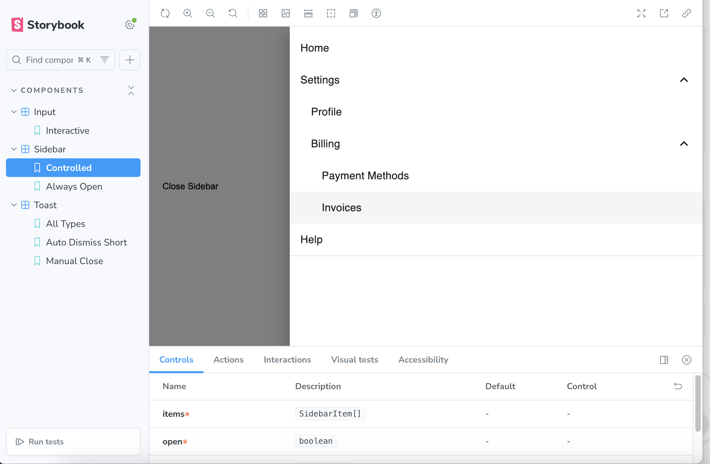
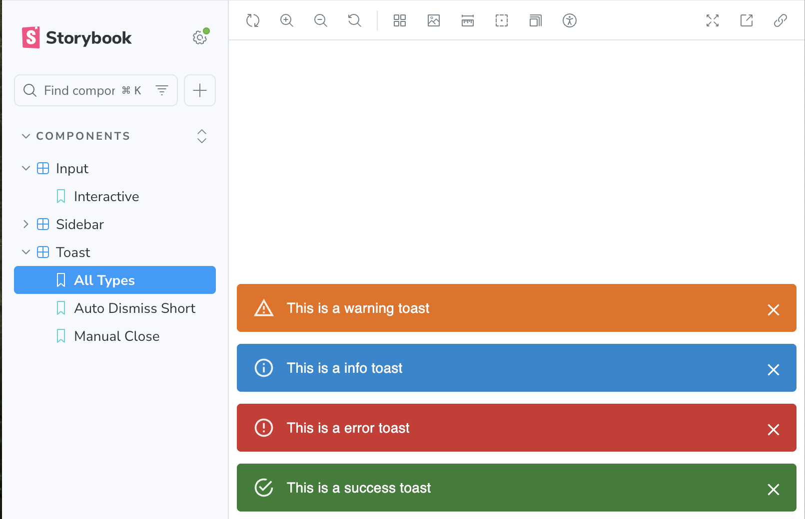
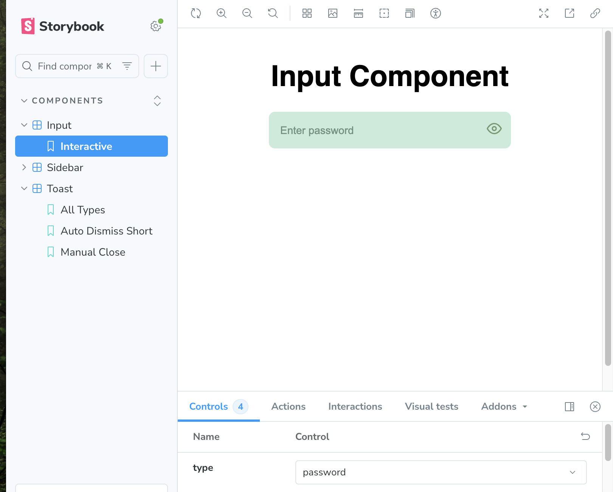

# Project Components

## Overview

This project contains reusable React components documented and demonstrated via Storybook:

**Note:** Components are showcased and tested through Storybook and are not part of a standalone
Next.js app.

- **Input**: text, password (with toggle), clearable
- **Sidebar**: collapsible drawer with nested menus
- **Toast**: notifications with auto-dismiss and manual close

## Screenshots

Include screenshots of:

 

- Each component in at least 2 states
- Storybook UI showing components

## Usage

1. Install dependencies:

npm install

# or

yarn install

2. Run Storybook:

npm run storybook

# or

yarn storybook
